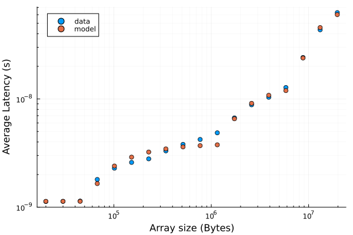

# Pointer Chasing and latency


It is possible to estimate the latency 
associated to different cache levels
and to the main memory by implementing
a pathological pattern of memory access
where the hardware cannot at all predict 
what address will be accessed 
before the previous address 
has been loaded and read.

This problem, which affects also real-life codes,
is called *pointer chasing*
and it is typical of code 
where objects contain references (pointers)
to other objects, which contain references 
to other objects and so on.

We will see this with a Julia example, 
based on [these notes](https://en.algorithmica.org/hpc/cpu-cache/latency/).

## Pointer chasing

This function will jump between positions in an array,
based on addresses that are read from it:

```{literalinclude} scripts/pointer-chasing-and-latency.jl
:language: julia
:lines: 202-207 
```

A possible way to create such an array
so that *all* the locations are actually visited
is:

```{literalinclude} scripts/pointer-chasing-and-latency.jl
:language: julia
:lines: 99-110
```

## A simple latency model

The average latency will be 
a mean of the latency associated 
to the different cache levels,
weighted by the size of the part of the dataset 
in each cache level.

A small enough array will fill in the L1 cache,
and the resulting latency will be "pure" from L1.
For array that "spills" into L2,
the latency will be a combination of L1 and L2 contributions,
and so on:

```{literalinclude} scripts/pointer-chasing-and-latency.jl
:language: julia
:lines: 181-200
```

The parameters of the model are:
- the cache sizes 
- the latency of all the cache levels,
  and the main memory latency
  
Fitting the latency model to the measured latencies
requires a some care 
(enough data points, sensible initial values for the parameters,
sensible form for the residuals)




The output of 
the [full julia script](./scripts/pointer-chasing-and-latency.jl):
```
Fit results (assuming 3 cache levels + dram):
	size: 54 KiB latency: 1 ns
	size: 1186 KiB latency: 4 ns
	size: 6034 KiB latency: 14 ns
	Main memory latency: 89.08 ns
```

The times have been measured with `@btime`.

The initial values from the cache sizes sizes
(48KiB, 1.25MiB and 8 MiB)
are actually from `likwid-topology`,
so the deviation from the values resulting from the fit
give an idea of the systematic error in the procedure.

By fixing the cache sizes to the initial, "official" values,
we get:
    
```
Fit results (assuming 3 cache levels + dram):
	size: 48 KiB latency: 1 ns
	size: 1282 KiB latency: 4 ns
	size: 8192 KiB latency: 16 ns
	Main memory latency: 116.02 ns
```
